<p align="center">
  
  
  
  
</p>

<h1 align="center">
  🌐 NetViz
</h1>

<p align="center">
  <strong>A real-time network request visualizer with animated topology, timing waterfalls, and live traffic simulation.</strong>
</p>

<p align="center">
  <em>Built as a demo project for a GitHub Copilot training workshop — showcasing modern React patterns, canvas animations, and dark-themed data visualization.</em>
</p>

---

## ✨ Features

| Feature | Description |
|---------|-------------|
| **🗺️ Animated Topology** | Live canvas rendering of network topology — Client, CDN, API Gateway, Server, and Database nodes with glowing packet animations traversing the graph in real time |
| **📋 Request Log** | Scrollable feed of captured HTTP requests with method badges, status codes, response times, and payload sizes |
| **🔍 Request Inspector** | Deep-dive panel showing full request/response headers, payload preview, and per-phase timing breakdown |
| **📊 Timing Waterfall** | Visual breakdown of each request phase — DNS lookup, TCP connect, TLS handshake, request send, and response download |
| **📈 Live Stats Dashboard** | Real-time KPIs: total requests, success/error counts, average response time, data transferred, and requests/sec |
| **🎮 Capture Controls** | Start/pause traffic capture, clear logs, and color-coded method legend (GET, POST, PUT, PATCH, DELETE) |

## 🎨 Design

- **Dark theme by default** — deep navy surfaces (`#0a0e17`) with vibrant accent colors
- **Glass-morphism panels** with subtle borders and backdrop effects
- **Canvas-rendered topology** with radial glow effects, dashed edges, and animated packet trails
- **Color-coded HTTP methods** — Blue (GET), Green (POST), Yellow (PUT), Red (DELETE/Error), Purple (PATCH)
- **Responsive grid layout** — adapts from mobile to widescreen

## 🏗️ Architecture

### System Overview


### Component Hierarchy

```mermaid
flowchart LR
    Root[🌐 App.tsx]
    Root --> Bar1[ControlBar]
    Root --> Bar2[StatsBar]
    Root --> Canvas[TopologyCanvas]
    Root --> List[RequestList]
    Root --> Inspect[RequestInspector]
    
    Inspect --> Water[TimingWaterfall]
    
    Root -.->|useNetworkCapture| Hook[useNetworkCapture Hook]
    Hook -.->|mockTraffic| Mock[Traffic Generator]
    
    classDef component fill:#0ea5e9,stroke:#0284c7,color:#fff
    classDef hook fill:#f59e0b,stroke:#d97706,color:#fff
    classDef service fill:#ec4899,stroke:#db2777,color:#fff
    
    class Root,Bar1,Bar2,Canvas,List,Inspect,Water component
    class Hook hook
    class Mock service
```



### Data Flow


### File Structure

```
src/
├── components/
│   ├── TopologyCanvas.tsx    # Canvas-based network topology with packet animation
│   ├── RequestList.tsx       # Scrollable request log with selection
│   ├── RequestInspector.tsx  # Detailed request/response viewer
│   ├── TimingWaterfall.tsx   # Per-phase timing visualization
│   ├── StatsBar.tsx          # Live KPI stat cards
│   └── ControlBar.tsx        # Capture toggle, clear, and legend
├── hooks/
│   └── useNetworkCapture.ts  # Core state management — requests, packets, stats
├── services/
│   └── mockTraffic.ts        # Realistic mock HTTP traffic generator
├── types/
│   └── network.ts            # TypeScript interfaces for the domain model
└── utils/
    └── colors.ts             # Color mappings, formatters, and ID generation
```

### Key Patterns

- **Zero external state libraries** — pure React hooks (`useState`, `useCallback`, `useRef`, `useEffect`)
- **`requestAnimationFrame` loop** for silky-smooth 60fps packet animations
- **Mock traffic engine** generating realistic HTTP requests with randomized timing phases, status codes, headers, and payloads
- **Canvas 2D API** with HiDPI scaling, radial gradients, glow effects, and motion trails
- **Strict TypeScript** — no `any`, fully typed domain model

## 🚀 Getting Started

### Prerequisites

- **Node.js** 18+
- **npm** or **yarn**

### Install & Run

```bash
# Clone the repository
git clone https://github.com/hoodini/netviz.git
cd netviz

# Install dependencies
npm install

# Start development server
npm run dev
```

Open [http://localhost:5173](http://localhost:5173) — traffic simulation starts automatically.

### Build for Production

```bash
npm run build
npm run preview
```

## 🛠️ Tech Stack

| Layer | Technology |
|-------|-----------|
| **UI Framework** | React 18 with functional components |
| **Language** | TypeScript (strict mode) |
| **Build Tool** | Vite 6 |
| **Styling** | Tailwind CSS 3.4 (dark mode, custom design tokens) |
| **Animations** | Canvas 2D API + requestAnimationFrame |
| **State** | React hooks only |

## 🎯 Workshop Context

This project was built as part of a **GitHub Copilot training workshop** to demonstrate:

- AI-assisted development workflows with Copilot
- Real-time data visualization in React
- Canvas animations and custom rendering
- TypeScript-first development with strict typing
- Modern frontend architecture patterns

## 📄 License

MIT

---

<p align="center">
  Built with ☕ and GitHub Copilot by <a href="https://github.com/hoodini">Yuval Avidani</a> — <a href="https://yuv.ai">YUV.AI</a>
</p>
